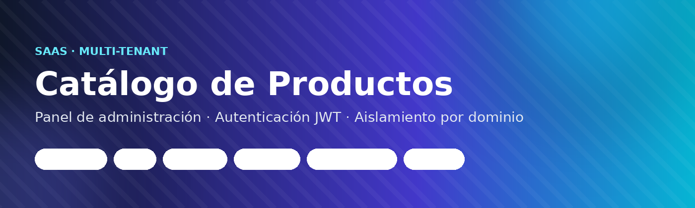
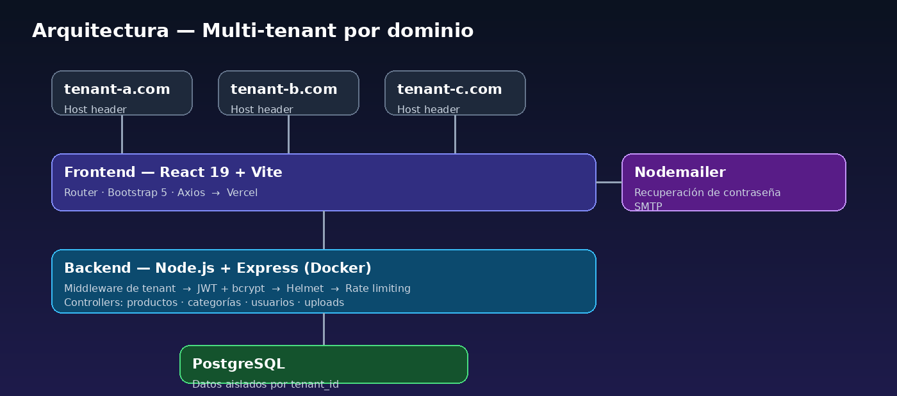
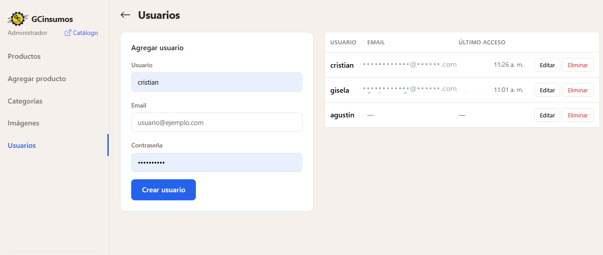

<div align="center">



<br/>

[](https://react.dev)
[](https://vitejs.dev)
[](https://nodejs.org)
[](https://expressjs.com)
[](https://www.postgresql.org)
[](https://www.docker.com)
[](https://vercel.com)
[](#licencia)

**Aplicación web para mostrar catálogos de productos**, con panel de administración,
autenticación JWT y **aislamiento multi‑tenant por dominio**.

[Características](#-características) ·
[Stack](#-stack) ·
[Arquitectura](#-arquitectura) ·
[Capturas](#️-capturas) ·
[Instalación](#-configuración) ·
[API](#-api) ·
[Estructura](#-estructura)

</div>

---

## 📑 Tabla de contenidos

- [Stack](#-stack)
- [Características](#-características)
- [Arquitectura](#-arquitectura)
- [Capturas](#️-capturas)
- [Requisitos](#-requisitos)
- [Configuración](#-configuración)
- [Ejecutar](#-ejecutar)
- [Variables de entorno](#-variables-de-entorno)
- [API](#-api)
- [Tests](#-tests)
- [Estructura](#-estructura)
- [Licencia](#-licencia)

---

## 🧱 Stack

| Capa | Tecnología |
|------|-----------|
| **Frontend** | React 19 · Vite · React Router · Bootstrap 5 · Axios |
| **Backend** | Node.js · Express · PostgreSQL |
| **Infra** | Docker (backend) · Vercel (frontend) |

---

## ✨ Características

### 🛍️ Catálogo público
- Listado de productos con paginación y búsqueda
- Filtro por categorías con carrusel horizontal (auto‑scroll + flechas)
- Vista detalle de producto
- Marcas de **"Sin stock"** con imagen en escala de grises
- Footer minimalista y marquesina promocional

### 🔐 Panel de administración (`/admin`)
- Dashboard con listado de productos, búsqueda y paginación
- CRUD de productos con subida de imágenes y galería
- CRUD de categorías
- CRUD de usuarios con email y último acceso
- Login / logout con JWT (expiración 24 h)
- Recuperación de contraseña por email (Nodemailer)

### 🛡️ Seguridad
- JWT con bcrypt
- Helmet (HTTP headers)
- Rate limiting (10 intentos / 15 min en login y forgot‑password)
- SQL parametrizado
- CORS dinámico

### 🏢 Multi‑tenant
- Aislamiento por dominio (Host header)
- Cada tenant tiene sus propios productos, categorías y usuarios
- Middleware de tenant automático en todas las rutas `/api`

---

## 🗺️ Arquitectura

<div align="center">

</div>

El `Host` header de cada request identifica al tenant; el middleware de tenant
resuelve el dominio contra la base y aísla las consultas de productos,
categorías y usuarios para esa organización, antes de llegar a los controllers.

---

## 🖼️ Capturas



---

## ✅ Requisitos

- Node.js 20+
- PostgreSQL 14+
- Docker (opcional, para backend)

---

## ⚙️ Configuración

### 1. Clonar

```bash
git clone https://github.com/GCsoft-R4/catalogo-cgcinsumos.git
cd catalogo-cgcinsumos
```

### 2. Backend

```bash
cd backend
cp .env.example .env
npm install
```

Editar `.env` con los datos de tu base PostgreSQL:

```env
PORT=5000
DB_HOST=localhost
DB_PORT=5432
DB_NAME=catalogo
DB_USER=postgres
DB_PASSWORD=postgres
JWT_SECRET=una_clave_segura
ADMIN_USER=admin
ADMIN_PASS=admin123
DEFAULT_DOMAIN=localhost
CORS_ORIGINS=http://localhost:5173
```

### 3. Frontend

```bash
cd frontend
npm install
```

Crear archivo `frontend/.env`:

```env
VITE_API_URL=http://localhost:5000
```

---

## 🚀 Ejecutar

### Desarrollo

```bash
# Terminal 1 — Backend
cd backend && npm start

# Terminal 2 — Frontend
cd frontend && npm run dev
```

### Producción (Docker)

```bash
git pull origin main
docker compose build backend
docker compose down
docker compose up -d
```

### Frontend (Vercel)

Conectar el repo a Vercel y agregar variable de entorno:

| Name | Value |
|------|-------|
| `VITE_API_URL` | `https://tu-dominio.com` |

---

## 🔧 Variables de entorno

### Backend (`.env`)

| Variable | Default | Descripción |
|----------|---------|-------------|
| `PORT` | `5000` | Puerto del servidor |
| `DB_HOST` | — | Host de PostgreSQL |
| `DB_PORT` | — | Puerto de PostgreSQL |
| `DB_NAME` | — | Nombre de la base |
| `DB_USER` | — | Usuario de la base |
| `DB_PASSWORD` | — | Contraseña |
| `JWT_SECRET` | `secretkey` | Clave para firmar JWT |
| `ADMIN_USER` | `admin` | Usuario admin del tenant por defecto |
| `ADMIN_PASS` | `admin123` | Contraseña del admin |
| `DEFAULT_DOMAIN` | `localhost` | Dominio del tenant por defecto |
| `CORS_ORIGINS` | — | Orígenes permitidos (separados por coma) |
| `SMTP_HOST` | `smtp.gmail.com` | Servidor SMTP |
| `SMTP_PORT` | `587` | Puerto SMTP |
| `SMTP_USER` | — | Usuario SMTP |
| `SMTP_PASS` | — | Contraseña de aplicación |
| `SMTP_FROM` | `SMTP_USER` | Dirección de remitente |

### Frontend (Vercel)

| Variable | Descripción |
|----------|-------------|
| `VITE_API_URL` | URL base de la API backend |

---

## 📡 API

### Públicos

| Método | Endpoint | Descripción |
|--------|----------|-------------|
| `GET` | `/api/productos` | Listar productos (paginado, filtro por categoría/búsqueda) |
| `GET` | `/api/productos/:id` | Detalle de producto |
| `GET` | `/api/categorias` | Listar categorías |
| `POST` | `/api/forgot-password` | Solicitar recuperación de contraseña |
| `POST` | `/api/reset-password` | Restablecer contraseña con token |

### Protegidos (requieren JWT)

| Método | Endpoint | Descripción |
|--------|----------|-------------|
| `POST` | `/api/login` | Iniciar sesión |
| `GET` | `/api/usuarios` | Listar usuarios |
| `POST` | `/api/usuarios` | Crear usuario |
| `PUT` | `/api/usuarios/:id` | Editar usuario |
| `DELETE` | `/api/usuarios/:id` | Eliminar usuario |
| `POST` | `/api/productos` | Crear producto |
| `PUT` | `/api/productos/:id` | Editar producto |
| `DELETE` | `/api/productos/:id` | Eliminar producto |
| `POST` | `/api/categorias` | Crear categoría |
| `PUT` | `/api/categorias/:id` | Editar categoría |
| `DELETE` | `/api/categorias/:id` | Eliminar categoría |
| `POST` | `/api/upload` | Subir imagen |
| `GET` | `/api/uploads` | Listar imágenes subidas |

---

## 🧪 Tests

```bash
cd backend && npm test
cd frontend && npm test
```

---

## 📂 Estructura

```
catalogo-cgcinsumos/
├── assets/              # banner.png, architecture.png, capturas
├── backend/
│   ├── config/          # db.js, mailer.js
│   ├── controllers/     # Lógica CRUD
│   ├── database/        # init.js (esquema + migraciones)
│   ├── middlewares/     # auth, tenant, upload, validation
│   ├── routes/          # Definición de rutas
│   ├── uploads/         # Imágenes subidas
│   ├── Dockerfile
│   ├── app.js
│   └── package.json
├── frontend/
│   └── src/
│       ├── components/  # Navbar, Sidebar, ProductCard, etc.
│       ├── layouts/     # AdminLayout, PublicLayout
│       ├── pages/       # Catalogo, Dashboard, ProductForm, etc.
│       └── services/    # api.js (Axios)
├── docker-compose.yml
└── README.md
```

---

## 📄 Licencia

Distribuido bajo licencia **MIT**.

<div align="center">
<sub>Hecho con 🧉 y mucho café — GCsoft</sub>
</div>
