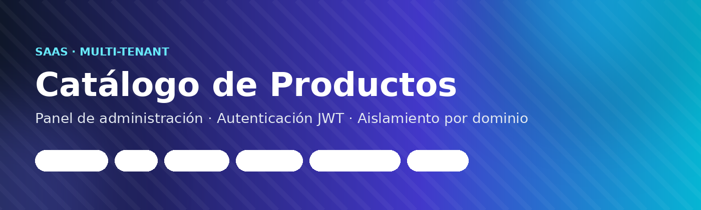

<div align="center">



<br/>

[](https://react.dev)
[](https://vitejs.dev)
[](https://nodejs.org)
[](https://expressjs.com)
[](https://www.postgresql.org)
[](https://www.docker.com)
[](https://vercel.com)
[](#licencia)

**Aplicación web para mostrar catálogos de productos**, con panel de administración,
autenticación JWT y **aislamiento multi‑tenant por dominio**.

[Características](#-características) ·
[Stack](#-stack) ·
[Arquitectura](#-arquitectura) ·
[Instalación](#-configuración) ·
[API](#-api) ·
[Estructura](#-estructura)

</div>

---

## 📑 Tabla de contenidos

- [Stack](#-stack)
- [Características](#-características)
- [Arquitectura](#-arquitectura)
- [Requisitos](#-requisitos)
- [Configuración](#-configuración)
- [Ejecutar](#-ejecutar)
- [Variables de entorno](#-variables-de-entorno)
- [Base de datos y migraciones](#-base-de-datos-y-migraciones)
- [Multi‑tenant](#-multi-tenant)
- [API](#-api)
- [Seguridad](#-seguridad)
- [Deploy en producción](#-deploy-en-producción)
- [Mantenimiento](#-mantenimiento)
- [Tests](#-tests)
- [Estructura](#-estructura)
- [Licencia](#-licencia)

---

## 🧱 Stack

| Capa | Tecnología |
|------|-----------|
| **Frontend** | React 19 · Vite · React Router v6 · Bootstrap 5 · Axios · jspdf (export PDF) · SheetJS/xlsx (export Excel) |
| **Backend** | Node.js 20 · Express · PostgreSQL |
| **Infra** | Docker (backend) · Vercel (frontend) · nginx (proxy reverso) |

---

## ✨ Características

### 🛍️ Catálogo público
- Listado de productos con paginación (24/página), búsqueda y filtro por categorías
- Carrusel de "Productos nuevos" (auto‑scroll + flechas); se oculta cuando hay filtro o búsqueda activa
- Vista detalle de producto con **variantes de color** (imagen por color, disponibles y agotadas)
- Marcas de **"Sin stock"** con imagen en escala de grises
- Botones de acción responsivos (estilo WhatsApp, ver detalle, agregar al carrito) que se adaptan a pantallas pequeñas
- Marquesina promocional, página "Nosotros", redes sociales y datos de contacto configurables
- Contador de visitas (IP + geo)

### 🔐 Panel de administración (`/admin`)
- Dashboard con listado de productos, búsqueda y paginación
- CRUD de productos con subida de imágenes (máx. 5 MB c/u, hasta 10 por producto), galería y variantes de color
- Importación masiva desde Excel/CSV
- CRUD de categorías
- CRUD de usuarios con email y último acceso
- Login / logout con JWT (expiración 24 h)
- Recuperación de contraseña por email con token de un solo uso (Nodemailer)
- Configuración del negocio: nombre, logo, colores de marca, marquesina, texto "Nosotros", teléfono, dirección, horarios y redes
- Panel de visitas con eliminación y limpieza

### 🛡️ Seguridad
- Passwords con bcrypt, JWT firmado (JWT_SECRET obligatorio al boot)
- Helmet (HTTP headers + CSP)
- Rate limiting: login / forgot-password / reset-password (10 intentos / 15 min), visitas (60 / 15 min), API general (500 / 15 min)
- SQL 100 % parametrizado
- CORS restringido a orígenes permitidos (default: dominios Vercel de producción)
- Subida de archivos validada por tipo y tamaño, con nombres UUID
- Path traversal mitigado en el borrado de imágenes
- Errores de base ocultos al cliente (respuestas genéricas)

---

## 🗺️ Arquitectura

```
                        ┌───────────────────────────┐
  Usuario → Vercel      │      Vercel (frontend)     │
   (HTTPS) ────────────►│  React SPA · vercel.json   │
                        │  headers CSP + rewrites    │
                        └────────────┬──────────────┘
                                     │ HTTPS (CORS)
                        ┌────────────▼──────────────┐
                        │  nginx (proxy reverso)     │
                        │  productosgc.duckdns.org   │
                        │  → 127.0.0.1:5000          │
                        └────────────┬──────────────┘
                                     │
                        ┌────────────▼──────────────┐
                        │  Docker: catalogoweb_backend│
                        │  Express API + uploads     │
                        └────────────┬──────────────┘
                                     │
                        ┌────────────▼──────────────┐
                        │  PostgreSQL                │
                        │  (catálogo)                │
                        └───────────────────────────┘
```

El `Host` header de cada request identifica al tenant; el middleware de tenant
resuelve el dominio contra la base y aísla las consultas de productos,
categorías y usuarios para esa organización, antes de llegar a los controllers.

> **Nota importante:** el frontend se sirve desde **Vercel**, no desde nginx.
> nginx solo proxya la API. El CSP de la SPA se configura en `vercel.json`,
> no en nginx. El backend **no** sirve la SPA.

---

## ✅ Requisitos

- Node.js 20+
- PostgreSQL 14+
- Docker y Docker Compose (para producción)
- Cuenta en Vercel (frontend)

---

## ⚙️ Configuración

### 1. Clonar

```bash
git clone https://github.com/GCsoft-R4/catalogo-cgcinsumos.git
cd catalogo-cgcinsumos
```

### 2. Backend

```bash
cd backend
cp .env.example .env
npm install
```

Editar `.env` con los datos de tu base PostgreSQL (ver [variables](#-variables-de-entorno)).

### 3. Frontend

```bash
cd frontend
npm install
```

Crear archivo `frontend/.env` (solo desarrollo):

```env
VITE_API_URL=http://localhost:5000
```

---

## 🚀 Ejecutar

### Desarrollo

```bash
# Terminal 1 — Backend (inicializa la DB y el admin automáticamente)
cd backend && npm start

# Terminal 2 — Frontend
cd frontend && npm run dev
```

### Producción (Docker)

```bash
git pull origin main
docker compose up -d --build backend
```

El backend expone solo `127.0.0.1:5000` (no es accesible desde afuera; nginx hace de entrada).

---

## 🔧 Variables de entorno

### Backend (`.env`)

| Variable | Default | Descripción |
|----------|---------|-------------|
| `PORT` | `5000` | Puerto del servidor |
| `DB_HOST` | — | Host de PostgreSQL |
| `DB_PORT` | — | Puerto de PostgreSQL |
| `DB_NAME` | — | Nombre de la base |
| `DB_USER` | — | Usuario de la base |
| `DB_PASSWORD` | — | Contraseña |
| `JWT_SECRET` | — | Clave para firmar JWT (**obligatoria**; el backend no arranca sin ella) |
| `ADMIN_USER` | `admin` | Usuario admin del tenant por defecto |
| `ADMIN_PASS` | — | Contraseña del admin (¡cambiarla en producción!) |
| `DEFAULT_DOMAIN` | `localhost` | Dominio del tenant por defecto |
| `CORS_ORIGINS` | dominios Vercel | Orígenes permitidos (separados por coma). Por defecto: `https://gc-catalogo.vercel.app,https://catalogo-web-nine.vercel.app` |
| `SMTP_HOST` | `smtp.gmail.com` | Servidor SMTP (recuperación de contraseña) |
| `SMTP_PORT` | `587` | Puerto SMTP |
| `SMTP_USER` | — | Usuario SMTP |
| `SMTP_PASS` | — | Contraseña de aplicación |
| `SMTP_FROM` | `SMTP_USER` | Dirección de remitente |

### Frontend (Vercel / `.env` local)

| Variable | Descripción |
|----------|-------------|
| `VITE_API_URL` | URL base de la API backend (prod: `https://productosgc.duckdns.org`) |

---

## 🗄️ Base de datos y migraciones

### Inicialización automática

Al arrancar, `backend/database/init.js` crea las tablas si no existen y aplica
migraciones idempotentes. También crea el tenant por defecto y el usuario admin
si no existen. **No hay que crear el esquema a mano.**

### Tablas

- `tenants` — organizaciones multi‑tenant (`name`, `slug`, `domain`)
- `productos` — nombre, descripción, precio, imagen principal, stock, `disponible`, `oferta`, `categoria_id`
- `producto_imagenes` — galería (`producto_id`, `filename`, `orden`)
- `producto_colores` — variantes de color (`producto_id`, `nombre`, `hex`, `imagen`, `disponible`, `orden`)
- `categorias` — nombre, slug, orden (slug único por tenant)
- `usuarios` — username, email, password (bcrypt), `ultimo_acceso` (único por tenant)
- `configuracion` — datos del negocio por tenant (nombre, logo, colores, marquesina, nosotros, teléfono, dirección, horarios, redes)
- `password_reset_tokens` — tokens de recuperación (un solo uso, expiran)
- `visitas` — registro de visitas por IP y página (+ geo JSONB)

### Migraciones manuales

Los archivos viven en `backend/database/migrations/`:

```bash
docker exec catalogoweb_backend node scripts/run-migration.js 001_producto_colores.sql
```

(O con psql si se prefiere, ejecutando el archivo directamente.)

---

## 🏢 Multi‑tenant

- Cada tenant se identifica por el `Host`/dominio del request (`backend/middlewares/tenant.js`).
- Cada tenant tiene **sus propios** productos, categorías, usuarios y configuración.
- El **slug** debe ser único; el **dominio** debe ser único.
- El admin login usa `username` + `tenant` (único por tenant).
- La SPA se sirve desde Vercel; cada dominio del tenant se conecta a la misma API, que resuelve el tenant por `Host`.

### Crear un tenant nuevo

```bash
docker exec catalogoweb_backend node scripts/create-tenant.js "<Nombre>" "<slug>" "<dominio.com>" [usuario] [clave]
# Ejemplo:
docker exec catalogoweb_backend node scripts/create-tenant.js "Mi Negocio" "mi-negocio" "mi-negocio.midominio.com" admin "clave-segura"
```

---

## 📡 API

Todas las rutas públicas y protegidas pasan por el middleware de tenant.

### Públicos

| Método | Endpoint | Descripción |
|--------|----------|-------------|
| `GET` | `/api/productos` | Listar productos (paginado, `?page`, `?limit`, `?categoria`, `?search`, `?oferta`) |
| `GET` | `/api/productos/:id` | Detalle de producto (colores: `?todas=1` para admin, si no solo `disponible`) |
| `GET` | `/api/categorias` | Listar categorías |
| `POST` | `/api/visitas` | Registrar una visita (IP + página) |
| `GET` | `/api/config` | Configuración pública del negocio |
| `POST` | `/api/forgot-password` | Solicitar recuperación de contraseña (rate‑limited) |
| `POST` | `/api/reset-password` | Restablecer contraseña con token (rate‑limited) |
| `GET` | `/health` | Health check (DB) |

### Protegidos (requieren JWT en `Authorization: Bearer <token>`)

| Método | Endpoint | Descripción |
|--------|----------|-------------|
| `POST` | `/api/login` | Iniciar sesión (rate‑limited) |
| `GET` | `/api/usuarios` | Listar usuarios |
| `POST` | `/api/usuarios` | Crear usuario |
| `PUT` | `/api/usuarios/:id` | Editar usuario |
| `DELETE` | `/api/usuarios/:id` | Eliminar usuario |
| `POST` | `/api/productos` | Crear producto (`multipart/form-data` con `imagenes[]`) |
| `POST` | `/api/productos/importar` | Importación masiva (Excel/CSV) |
| `PUT` | `/api/productos/:id` | Editar producto |
| `DELETE` | `/api/productos/:id` | Eliminar producto |
| `POST` | `/api/categorias` | Crear categoría |
| `PUT` | `/api/categorias/:id` | Editar categoría |
| `DELETE` | `/api/categorias/:id` | Eliminar categoría |
| `POST` | `/api/upload` | Subir una imagen |
| `POST` | `/api/upload/multiple` | Subir varias imágenes (hasta 20) |
| `GET` | `/api/uploads` | Listar imágenes subidas |
| `DELETE` | `/api/uploads/:filename` | Eliminar imagen |
| `PUT` | `/api/config` | Actualizar configuración del negocio |
| `POST` | `/api/config/logo` | Subir logo |
| `DELETE` | `/api/config/logo` | Eliminar logo |
| `GET` | `/api/visitas` | Listar visitas |
| `DELETE` | `/api/visitas` | Limpiar todas las visitas |
| `DELETE` | `/api/visitas/:id` | Eliminar una visita |

---

## 🛡️ Seguridad

### Resumen implementado
- **Helmet + CSP**: `script-src 'self'` (sin `unsafe-inline` en el frontend servido por Vercel), `frame-ancestors 'none'`, `nosniff`, `Referrer-Policy`, `Permissions-Policy`.
- **Rate limiting**: ver [Características](#-seguridad). Aplica antes del middleware de tenant para no golpear la DB.
- **Errores seguros**: la API responde `error: 'Error interno del servidor'` ante fallos internos, sin exponer detalles de la DB.
- **Uploads**: límite 5 MB, extensión/tipo validados, nombre aleatorio UUID, y borrado protegido contra path traversal.
- **Reset de contraseña**: token UUID de un solo uso con expiración (1 h), sin enumeración de usuarios.

### CSP del frontend (Vercel)
El CSP de la SPA se define en `frontend/vercel.json`:

```
default-src 'self'; script-src 'self'; style-src 'self' 'unsafe-inline';
img-src 'self' data: https://placehold.co https://productosgc.duckdns.org https://serenidad-gp.duckdns.org;
font-src 'self'; connect-src 'self' https://productosgc.duckdns.org https://serenidad-gp.duckdns.org;
frame-ancestors 'none'; base-uri 'self'; form-action 'self'
```

> Si agregás un dominio de tenant, tenés que sumarlo a `img-src` y `connect-src`
> (y al `CORS_ORIGINS` del backend).

### Deuda técnica conocida
- El JWT se guarda en `localStorage` (aceptado; migrar a cookie `httpOnly` implica re‑diseñar el flujo de auth y riesgo de CSRF/lockout).
- La validación de archivos se basa en tipo MIME/extensión (mejorar con magic bytes).
- `GET /api/productos/:id?todas=1` no requiere JWT (diseño para el panel; aceptado).
- `react-router-dom` está en v6 (v7 corrige un open redirect, pero el upgrade puede romper rutas).

---

## 🚀 Deploy en producción

### 1. Backend (Docker + nginx)

```bash
# En el server
cd /apps/catalogoweb
git pull origin main
docker compose up -d --build backend
docker compose ps
```

Verificar:

```bash
curl http://127.0.0.1:5000/health
```

**nginx** proxya `productosgc.duckdns.org` → `127.0.0.1:5000` (SSL con certbot).
Requisito: `client_max_body_size 10M;` para que las subidas lleguen al backend.

### 2. Frontend (Vercel)

- Conectar el repo a Vercel, proyecto con root en `frontend/`.
- Build command: `npm run build`, output: `dist`.
- Variable de entorno en Vercel:

| Name | Value |
|------|-------|
| `VITE_API_URL` | `https://productosgc.duckdns.org` |

- `vercel.json` ya incluye `rewrites` (SPA) y los headers de seguridad.
- Agregar el dominio del tenant (p. ej. `gc-catalogo.vercel.app`) en el proyecto Vercel y en el CORS del backend.

### 3. DNS
- `productosgc.duckdns.org` → IP del server (DuckDNS).
- El dominio público del catálogo → proyecto Vercel.

---

## 🔧 Mantenimiento

```bash
# Aplicar una migración
docker exec catalogoweb_backend node scripts/run-migration.js 001_producto_colores.sql

# Crear un tenant nuevo
docker exec catalogoweb_backend node scripts/create-tenant.js "Negocio" "negocio" "dominio.com" admin "clave"

# Deduplicar productos repetidos
docker exec catalogoweb_backend node scripts/dedupe-productos.js

# Capitalizar nombres de productos
docker exec catalogoweb_backend node scripts/capitalize-productos.js

# Logs
docker logs -f catalogoweb_backend

# Backup de la base
docker exec catalogoweb_backend pg_dump -U postgres catalogo > backup_$(date +%F).sql
```

---

## 🧪 Tests

```bash
cd backend && npm test
cd frontend && npm test
```

---

## 📂 Estructura

```
catalogo-cgcinsumos/
├── assets/                    # banner.png, architecture.png, capturas
├── backend/
│   ├── config/                # db.js (pool pg), mailer.js (nodemailer)
│   ├── controllers/           # auth, producto, usuario, categoria, upload, reset, config, visitas
│   ├── database/
│   │   ├── init.js            # esquema + migraciones idempotentes + seed admin
│   │   └── migrations/        # 001_producto_colores.sql, ...
│   ├── middlewares/           # auth (JWT), tenant, upload (multer), validation
│   ├── routes/                # productos, usuarios, categorias, auth, reset, config, visitas
│   ├── scripts/               # run-migration, create-tenant, dedupe-productos, capitalize-productos
│   ├── uploads/               # imágenes subidas (volumen Docker)
│   ├── __tests__/             # vitest + supertest
│   ├── app.js                 # express: helmet, CORS, rate-limit, tenant, rutas, errors
│   ├── Dockerfile
│   └── package.json
├── frontend/
│   ├── src/
│   │   ├── components/        # Navbar, Sidebar, ProductCard, Carrusel, Spinner, ...
│   │   ├── context/           # ConfigContext, CartContext
│   │   ├── layouts/           # AdminLayout, PublicLayout
│   │   ├── pages/             # Catalogo, Dashboard, ProductForm, Categorias, Imagenes, Usuarios, Configuracion, Visitas, Login, ...
│   │   ├── services/          # api.js (Axios), navigation.js
│   │   ├── App.jsx            # rutas (React Router)
│   │   └── main.jsx
│   ├── vercel.json            # rewrites SPA + headers CSP
│   ├── vite.config.js
│   └── package.json
├── docker-compose.yml         # solo backend, 127.0.0.1:5000:5000
└── README.md
```

---

## 📄 Licencia

Distribuido bajo licencia **MIT**.

<div align="center">
<sub>Hecho con 🧉 y mucho café — GCsoft</sub>
</div>
